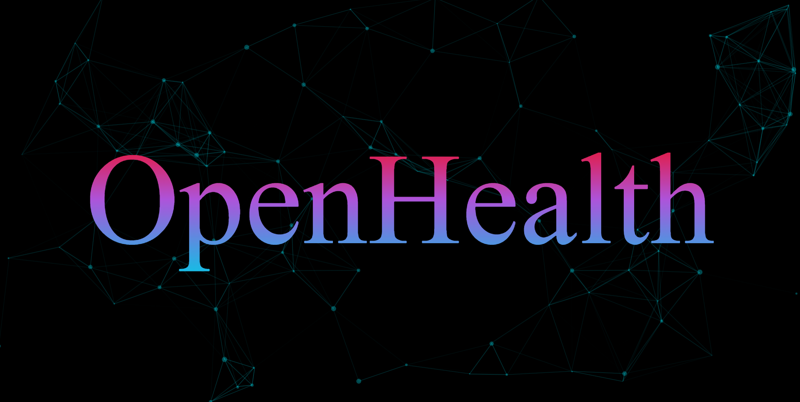

# OpenHealth: A Comprehensive AI Tool for Remote Health Care    (Under Development)



Connect with me on social media and explore my work:

[](https://www.linkedin.com/in/hemakalyan)
[](https://github.com/KalyanMurapaka45)
[](https://medium.com/@kalyanmurapaka274)
[](https://twitter.com/KalyanM45)
[](https://github.com/sponsors/KalyanM45)

**Special Thanks to GitHub Sponsors**

## About The Project

In an era where healthcare demands precision, accessibility, and personalised solutions, "OpenHealth" emerges as a groundbreaking initiative at the intersection of technology and medicine. This comprehensive project focuses on Multi-Disease Detection, employing a diverse set of algorithms, including traditional machine learning models, deep learning models, transfer learning, and hybrid models such as VGG-19, ResNet50, Random Forest, and Gradient Boosting. Diseases across specific organs, such as the brain, kidney, heart, liver, and lungs, are accurately predicted, and model performance is rigorously assessed through metrics like accuracy, precision, recall, and F1-score. Adding a layer of sophistication, "OpenHealth" integrates with large language models from Open-source libraries like Hugging Face and GenerativeAI from Google, providing personalised information based on individual health profiles. Furthermore, the project extends its impact by incorporating an AI dietitian and food recommender, tailoring dietary recommendations to individual health conditions. Meticulous organisation is ensured through dedicated directory structures, fostering a modular and maintainable framework. Leveraging Machine Learning operations like Dockers, Data Version Control, and MLflow enhances the overall efficiency and reliability of healthcare systems. In essence, "OpenHealth" represents a transformative force that leverages cutting-edge technologies to usher in a new era of healthcare characterised by accuracy, personalization, and efficiency.


## Library Requirements

 - Pandas
 - Numpy
 - Scikit-learn
 - Seaborn
 - Matplotlib
 - Flask 
 - DVC
 - Catboost
 - XGBoost
 - MLflow
 - Google.generativeai
 - Streamlit

## Getting Started

This will help you understand how you may give instructions on setting up your project locally.
To get a local copy up and running follow these simple example steps.

## Installation Steps

### Option 1: Installation from GitHub

Follow these steps to install and set up the project directly from the GitHub repository:

1. **Clone the Repository**
   - Open your terminal or command prompt.
   - Navigate to the directory where you want to install the project.
   - Run the following command to clone the GitHub repository:
     ```
     git clone https://github.com/KalyanMurapaka45/OpenHealth.git
     ```

2. **Create a Virtual Environment** (Optional but recommended)
   - It's a good practice to create a virtual environment to manage project dependencies. Run the following command:
     ```
     conda create -p <Environment_Name> python==<python version> -y
     ```

3. **Activate the Virtual Environment** (Optional)
   - Activate the virtual environment based on your operating system:
       ```
       conda activate <Environment_Name>/
       ```

4. **Install Dependencies**
   - Navigate to the project directory:
     ```
     cd [project_directory]
     ```
   - Run the following command to install project dependencies:
     ```
     pip install -r requirements.txt
     ```

5. **Run the Project**
   - Start the project by running the appropriate command.
     ```
     python app.py
     ```

6. **Access the Project**
   - Open a web browser or the appropriate client to access the project.


### Option 2: Installation from DockerHub (Coming Soon)

If you prefer to use Docker, you can install and run the project using a Docker container from DockerHub:

1. **Pull the Docker Image**
   - Open your terminal or command prompt.
   - Run the following command to pull the Docker image from DockerHub:
     ```
     docker pull kalyan45/<IMAGE>
     ```
     This command downloads the Docker image from the DockerHub.

2. **Run the Docker Container**
   - Start the Docker container by running the following command. Adjust the port mapping as needed:
     ```
     docker run -p 5000:5000 kalyan45/<IMAGE>
     ```
     This command launches the project within a Docker container.

3. **Access the Project**
   - Open a web browser or the appropriate client to access the project.<br>


## API Key Setup

To use this project, you need an API key from Google Gemini Large Language Model. Follow these steps to obtain and set up your API key:

1. **Get API Key:**
   - Visit the Provided Link [Click Here](https://makersuite.google.com/app/apikey).
   - Follow the instructions to create an account and obtain your API key.

2. **Set Up API Key:**
   - Create a file named `.env` in the project root.
   - Add your API key to the `.env` file:
     ```dotenv
     API_KEY=your_api_key_here
     ```

   **Note:** Keep your API key confidential. Do not share it publicly or expose it in your code.<br>


## Contributing

Contributions are what make the open-source community such an amazing place to learn, inspire, and create. Any contributions you make are **greatly appreciated**.

• **Report bugs**: If you encounter any bugs, please let us know. Open up an issue and let us know the problem.

• **Contribute code**: If you are a developer and want to contribute, follow the instructions below to get started!

1. Fork the Project
2. Create your Feature Branch
3. Commit your Changes
4. Push to the Branch
5. Open a Pull Request

• **Suggestions**: If you don't want to code but have some awesome ideas, open up an issue explaining some updates or improvements you would like to see!

#### Don't forget to give the project a star! Thanks again!

## License

This project is licensed under the [Open Source Initiative (OSI)](https://opensource.org/) approved GNU General Public License v3.0 License - see the [LICENSE.txt](LICENSE.txt) file for details.<br>


## Contact Details

Hema Kalyan Murapaka - [kalyanmurapaka274@gmail.com](kalyanmurapaka274@gmail.com)<br>


## Acknowledgements

We'd like to extend our gratitude to all individuals and organizations who have played a role in the development and success of this project. Your support, whether through contributions, inspiration, or encouragement, has been invaluable. Thank you for being a part of our journey.
